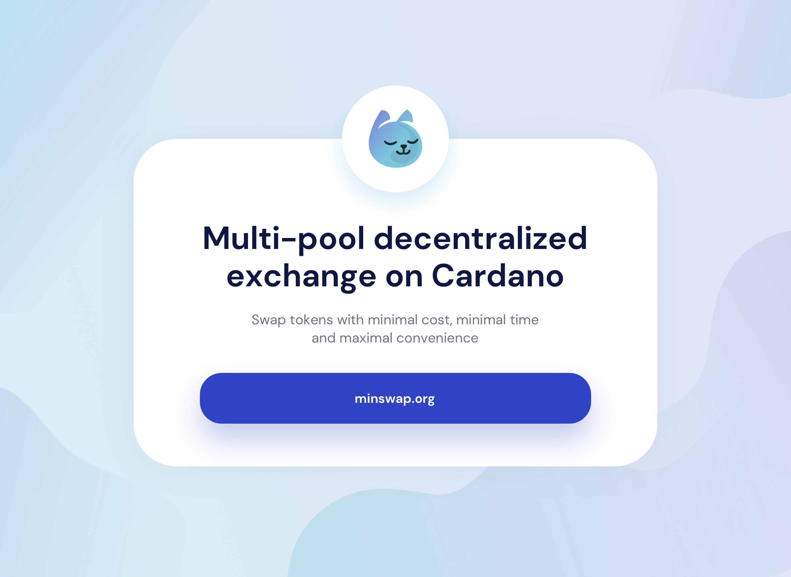

# Introduction

With the upcoming release of Alonzo, there will be a lot of innovative projects looking for a place to initially distribute their tokens. There will also be lots of DeFi users looking for a place to trade new tokens as well as support their favorite projects. This is the premise of Minswap - a multi-pool automated market maker. What is multi-pool, anyway? It means that there can be multiple pricing functions for one single pair, for example constant-product function, StableSwap invariant, Kyber's DMM function, etc. The trading interface will compute and route to the most efficient pools.

## Features

* **Fair Distribution:** MIN tokens are distributed fairly to protocol participants and early adopters.
* **Yield Farming:** MIN tokens are rewarded to liquidity providers who stake their liquidity pool tokens.  
* **Launchpool:** Supporting new projects in Cardano ecosystem with Initial DEX Offering \(IDO\) and Initial Farm Offering \(IFO\).  
* **Permissionless:** Anybody can list tokens without permission. Anybody can trade tokens without KYC.  
* **Community First:** All trading fees go directly to liquidity providers. MIN token holders can vote democratically on protocol changes.  
* **Ethereum Compatible**: With ERC-20 Converter, users can trade Ethereum tokens at much lower fees.  
* **Stake Pool Operators Support**: Minswap supports the SPOs by a community-oriented ADA delegation policy and automatic native token fees conversion. \(more details in FAQ\)

## Roadmap

* **Q2 2021:** Fundraising, Constant-Product Pool, Testnet  
* **Q3 2021:** Mainnet, Security Audit, Liquidity Mining, Initial DEX Offering \(IDO\), Initial Farm Offering \(IFO\)  
* **Q4 2021:** Stable Pool  
* **Q1 2022:** Decentralized Autonomous Organization \(DAO\), Community Governance

## Token Distribution

